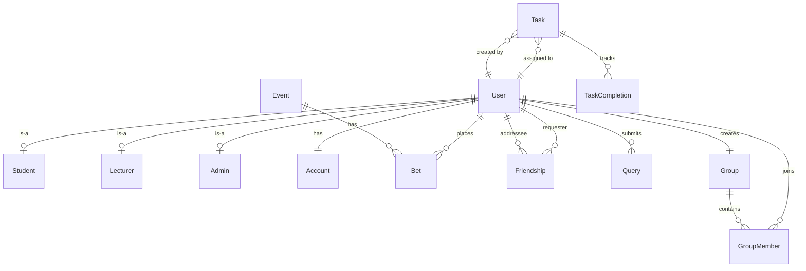

# MadiBets — Project Documentation

> **Team**: The Bloodline | **Module**: WRRV301  
> **Generated**: 22 July 2026  

---

## 1. Project Overview

**MadiBets** is a university-internal prediction-market platform for Nelson Mandela University. Students and lecturers wager virtual currency ("MadiBucks") on campus events — academic, sport, and social. The system is a full-stack Java web application built on Spring Boot with a MySQL database and a vanilla HTML/CSS/JS frontend.

### Tech Stack

| Layer | Technology | Version |
|---|---|---|
| Language | Java | 17 |
| Framework | Spring Boot (starter-web) | 3.3.0 |
| Build | Maven | — |
| Database | MySQL | 8.0 |
| JDBC Driver | MySQL Connector/J | (managed by Spring) |
| Password Hashing | jBCrypt | 0.4 |
| Frontend | Vanilla HTML + CSS + JavaScript | — |
| Fonts | Google Fonts (Outfit, Plus Jakarta Sans) | — |
| Server Port | `8081` | — |

---

## 2. Project Structure

```
MadiBets/
├── .gitignore
├── pom.xml                               # Maven build config (Spring Boot parent)
├── README.md                             # Team onboarding guide
├── db/
│   ├── db.properties.example             # Template — credentials placeholder
│   ├── db.properties                     # Local credentials (git-ignored)
│   ├── madibets_schema.sql               # Full schema: 11 tables, design notes
│   └── seed_admin.sql                    # Inserts the default Admin account
├── src/main/java/com/bloodline/madibets/
│   ├── Main.java                         # Spring Boot entry point
│   ├── config/
│   │   └── DatabaseConnection.java       # JDBC helper (reads db.properties)
│   ├── model/
│   │   ├── User.java                     # ✅ Fully implemented POJO
│   │   ├── Bet.java                      # ⬜ Stub (only betID, userID)
│   │   ├── Friendship.java              # ⬜ Stub (only friendshipID)
│   │   └── Group.java                   # ⬜ Stub (only groupID)
│   ├── dao/
│   │   ├── UserDAO.java                  # ✅ Full CRUD + balance query
│   │   ├── AccountDAO.java              # ⬜ Stub
│   │   ├── BetDAO.java                  # ⬜ Stub
│   │   ├── FriendshipDAO.java           # ⬜ Stub
│   │   ├── GroupDAO.java                # ⬜ Stub
│   │   ├── LeaderboardDAO.java          # ⬜ Stub
│   │   ├── QueryDAO.java               # ⬜ Stub
│   │   └── TaskDAO.java                # ⬜ Stub
│   ├── service/
│   │   ├── AuthService.java             # ✅ Register (BCrypt) + Login
│   │   └── AccountService.java          # ⬜ Stub
│   └── controller/
│       ├── AuthController.java          # ✅ REST: /api/auth/register, /api/auth/login
│       ├── UserController.java          # ✅ REST: /api/users/{id} (GET, PUT, DELETE)
│       └── README.txt                   # Notes for the controller layer
├── src/main/resources/
│   ├── application.properties           # server.port=8081
│   ├── db.properties                    # Local MySQL creds (git-ignored)
│   └── static/
│       ├── index.html                   # 908-line SPA (landing, auth, dashboard)
│       ├── style.css                    # 27 KB of custom CSS
│       ├── app.js                       # 441-line client-side logic
│       ├── logo.png                     # MadiBets logo
│       └── banner.png                   # Landing page banner
└── target/                              # Maven build output (git-ignored)
```

---

## 3. Database Schema

The schema lives in [madibets_schema.sql](file:///c:/Users/siwap/OneDrive/Documents/GitHub/MadiBets/db/madibets_schema.sql) and defines **11 tables** in the `madibets` database:

### Entity-Relationship Summary



### Table Details

| Table | Purpose | Key Columns |
|---|---|---|
| `User` | Core identity | `userID` (PK, auto), `name`, `surname`, `email` (unique), `password` (hash), `userType` (ENUM: STUDENT/LECTURER/ADMIN) |
| `Student` | Subtype of User (1:1) | `userID` (PK+FK), `studentNo` (unique) |
| `Lecturer` | Subtype of User (1:1) | `userID` (PK+FK), `staffNo` (unique) |
| `Admin` | Subtype of User (1:1) | `userID` (PK+FK) |
| `Account` | MadiBucks wallet | `accountID` (PK), `userID` (FK, unique), `balance` (default 100.00) |
| `Transaction` | Payout log | `transactionID` (PK), `payoutAmount`, `description`, `date` |
| `Event` | Betting event | `eventID` (PK), `eventDescription`, `date`, `startTime`, `endTime`, `status` (ENUM) |
| `Bet` | User wager | `betID` (PK), `userID` (FK), `eventID` (FK), `description`, `odds`, `outcome` (ENUM), `gradedBy` (FK) |
| `Friendship` | Social connections | `friendshipID` (PK), `requesterID`/`addresseID` (FKs), `status` (ENUM: PENDING/ACCEPTED/REJECTED) |
| `Group` | Leagues/groups | `groupID` (PK), `groupName`, `description`, `createdBy` (FK) |
| `GroupMember` | Group membership | `groupMemberID` (PK), `groupID`/`userID` (FKs), `role` (ENUM: OWNER/MEMBER) |
| `Task` | Lecturer-set tasks | `taskID` (PK), `userID` (FK), `amount` (MadiBucks reward), `createdBy` (FK) |
| `TaskCompletion` | Task completion tracking | `completionID` (PK), `taskID`/`userID` (FKs), `completionStatus` (ENUM) |
| `Query` | Support tickets | `queryID` (PK), `description`, `userID` (FK), `resolvedStatus` (ENUM: OPEN/RESOLVED) |

### Seed Data

[seed_admin.sql](file:///c:/Users/siwap/OneDrive/Documents/GitHub/MadiBets/db/seed_admin.sql) creates the initial admin account:
- **Email**: `admin@mandela.ac.za`
- **Password**: `12345` (stored as BCrypt hash)
- **Balance**: 0.00 MB

---

## 4. Backend — What's Been Implemented

### 4.1 Fully Implemented (✅)

#### [DatabaseConnection.java](file:///c:/Users/siwap/OneDrive/Documents/GitHub/MadiBets/src/main/java/com/bloodline/madibets/config/DatabaseConnection.java)
- Reads `db.properties` from the classpath at class-load time
- Provides `getConnection()` — a static factory returning a raw JDBC `Connection`
- Fails fast with a clear message if `db.properties` is missing

#### [User.java](file:///c:/Users/siwap/OneDrive/Documents/GitHub/MadiBets/src/main/java/com/bloodline/madibets/model/User.java) (Model)
- Fields: `userID`, `name`, `surname`, `email`, `password`, `userType`, `studentNo`, `staffNo`
- Full getters/setters, no-arg + parameterised constructors

#### [UserDAO.java](file:///c:/Users/siwap/OneDrive/Documents/GitHub/MadiBets/src/main/java/com/bloodline/madibets/dao/UserDAO.java) (DAO)

| Method | Use Case | Description |
|---|---|---|
| `register(User)` | A100 | Transactional insert into `User` + subtype table (`Student`/`Lecturer`/`Admin`) + `Account` (100 MB). Returns generated `userID`. |
| `findByEmail(String)` | A200 | Joins `User`, `Student`, `Lecturer` to return a full `User` by email. |
| `findById(int)` | A300 | Same join, lookup by `userID`. |
| `updateProfile(User)` | A400 | Updates `name`, `surname`, `email` on `User`. |
| `delete(int)` | A600 | Deletes user by `userID` (cascades via FK). |
| `getAccountBalance(int)` | — | Reads `balance` from `Account` for a given `userID`. |

#### [AuthService.java](file:///c:/Users/siwap/OneDrive/Documents/GitHub/MadiBets/src/main/java/com/bloodline/madibets/service/AuthService.java) (Service)

| Method | Use Case | Description |
|---|---|---|
| `register(User, String)` | A100 | Hashes password with BCrypt, delegates to `UserDAO.register()`. |
| `login(String, String)` | A200 | Looks up user by email, verifies BCrypt hash. Returns `User` on success, `null` on failure. |

#### [AuthController.java](file:///c:/Users/siwap/OneDrive/Documents/GitHub/MadiBets/src/main/java/com/bloodline/madibets/controller/AuthController.java) (REST Controller)

| Endpoint | Method | Validations |
|---|---|---|
| `POST /api/auth/register` | Register | All required fields, `@mandela.ac.za` email only, 9-digit student no., staff no. for lecturers, duplicate detection |
| `POST /api/auth/login` | Login | Email + password required, returns user object + balance on success, 401 on bad credentials |

#### [UserController.java](file:///c:/Users/siwap/OneDrive/Documents/GitHub/MadiBets/src/main/java/com/bloodline/madibets/controller/UserController.java) (REST Controller)

| Endpoint | Method | Description |
|---|---|---|
| `GET /api/users/{id}` | View Profile | Returns user + account balance (password stripped) |
| `PUT /api/users/{id}` | Update Profile | Updates name, surname, email |
| `DELETE /api/users/{id}` | Delete Account | Permanently removes user |

---

### 4.2 Stub Only (⬜ — Not Yet Implemented)

These files exist as placeholders with use-case comments but **no SQL or logic**:

| File | Owner | Planned Use Cases |
|---|---|---|
| [Bet.java](file:///c:/Users/siwap/OneDrive/Documents/GitHub/MadiBets/src/main/java/com/bloodline/madibets/model/Bet.java) | Kieran | POJO stub — missing most fields |
| [Friendship.java](file:///c:/Users/siwap/OneDrive/Documents/GitHub/MadiBets/src/main/java/com/bloodline/madibets/model/Friendship.java) | Jason | POJO stub — missing most fields |
| [Group.java](file:///c:/Users/siwap/OneDrive/Documents/GitHub/MadiBets/src/main/java/com/bloodline/madibets/model/Group.java) | Pieter | POJO stub — missing most fields |
| [BetDAO.java](file:///c:/Users/siwap/OneDrive/Documents/GitHub/MadiBets/src/main/java/com/bloodline/madibets/dao/BetDAO.java) | Kieran | B100 Place, B200 Propose, B400 Grade, B500 Delete, B700 View |
| [AccountDAO.java](file:///c:/Users/siwap/OneDrive/Documents/GitHub/MadiBets/src/main/java/com/bloodline/madibets/dao/AccountDAO.java) | Kieran | B600 Balance updates, Transaction logging |
| [FriendshipDAO.java](file:///c:/Users/siwap/OneDrive/Documents/GitHub/MadiBets/src/main/java/com/bloodline/madibets/dao/FriendshipDAO.java) | Jason | C100 View, C200 Add, C300 Remove friends |
| [LeaderboardDAO.java](file:///c:/Users/siwap/OneDrive/Documents/GitHub/MadiBets/src/main/java/com/bloodline/madibets/dao/LeaderboardDAO.java) | Jason | C400 Bet history, C500 Rankings, C600 Scheduled update |
| [GroupDAO.java](file:///c:/Users/siwap/OneDrive/Documents/GitHub/MadiBets/src/main/java/com/bloodline/madibets/dao/GroupDAO.java) | Pieter | D100 Create, D200 View, D300 Join group |
| [TaskDAO.java](file:///c:/Users/siwap/OneDrive/Documents/GitHub/MadiBets/src/main/java/com/bloodline/madibets/dao/TaskDAO.java) | Pieter | D400 Create, D500 View tasks |
| [QueryDAO.java](file:///c:/Users/siwap/OneDrive/Documents/GitHub/MadiBets/src/main/java/com/bloodline/madibets/dao/QueryDAO.java) | Pieter | D600 Log, D700 Review queries |
| [AccountService.java](file:///c:/Users/siwap/OneDrive/Documents/GitHub/MadiBets/src/main/java/com/bloodline/madibets/service/AccountService.java) | Kieran | Monthly allowance, bet settlement, balance reads |

---

## 5. Frontend — What's Been Implemented

The frontend is a **single-page application** (SPA) served as static files from Spring Boot at `http://localhost:8081`.

### 5.1 Views & Panels

| View / Panel | Status | Description |
|---|---|---|
| **Landing Page** (`landing-view`) | ✅ Working | Splash screen with logo, banner, Register/Login buttons |
| **Auth View** (`auth-view`) | ✅ Working | Login & Registration forms with Student/Lecturer role toggle |
| **Student Dashboard** (`panel-dashboard`) | ✅ UI built | Stats cards (hardcoded values), prompt bar, wallet card, profile viewer/editor |
| **Lecturer Dashboard** (`panel-dashboard-lecturer`) | ✅ UI built | Lecturer-specific layout with groups navigation |
| **Admin Dashboard** (`panel-dashboard-admin`) | ✅ UI built | Admin overview panel |
| Help Panel (`panel-help`) | ✅ UI built | Feedback form (title + body → toast notification, no backend) |
| Groups Panel (`panel-groups`) | ✅ UI shell | Layout exists, no backend integration |
| Delete Request Panel (`panel-delete-request`) | ✅ UI shell | Admin panel, no backend integration |
| User Management (`panel-user-management`) | ✅ UI shell | Admin panel, no backend integration |
| MadiBucks (`panel-madibucks`) | ✅ UI shell | Admin panel, no backend integration |
| Accounting (`panel-accounting`) | ✅ UI shell | Admin panel, no backend integration |
| Reports (`panel-reports`) | ✅ UI shell | Admin panel, no backend integration |
| Settings (`panel-settings`) | ✅ UI shell | Admin panel, no backend integration |
| Query (`panel-query`) | ✅ UI shell | Admin panel, no backend integration |

### 5.2 Working Frontend Features

| Feature | Details |
|---|---|
| **Registration** | Form validates `@mandela.ac.za` email, 9-digit student no., role toggle (Student/Lecturer). Calls `POST /api/auth/register`. |
| **Login** | Email + password form. Calls `POST /api/auth/login`. Stores user in `sessionStorage`. |
| **Session Persistence** | On page load, checks `sessionStorage` for a saved user and auto-loads the dashboard. |
| **Profile Display** | Shows name, email, userType, studentNo/staffNo. Reads from `GET /api/users/{id}`. |
| **Profile Editing** | Inline edit form (name, surname, email). Calls `PUT /api/users/{id}`. |
| **Account Deletion** | Confirmation dialog → `DELETE /api/users/{id}` → logout. |
| **Logout** | Clears `sessionStorage`, returns to auth view. |
| **Role-Based Navigation** | Three separate sidebar navs shown by `userType`: Student, Lecturer, Admin. |
| **Collapsible Sidebar** | Toggle button collapses/expands the navigation sidebar with icon swap. |
| **Password Visibility Toggle** | Eye icon toggles password input between text/password. |
| **Toast Notifications** | Success/error toasts with auto-dismiss (4 seconds). |
| **Wallet Display** | Shows MadiBucks balance in header and wallet card. |

### 5.3 Design & Styling

- **Fonts**: Outfit (headings), Plus Jakarta Sans (body) via Google Fonts
- **Color Scheme**: Navy (`#1B2F5E`), gold (`#F5A623`), light gray background (`#F4F6FA`)
- **Assets**: Custom logo (`logo.png`) and banner image (`banner.png`)
- **CSS**: ~28 KB of custom CSS with sidebar, cards, glassmorphism auth forms, responsive layout

---

## 6. API Reference

Base URL: `http://localhost:8081/api`

| Endpoint | Method | Request Body | Success Response | Error Response |
|---|---|---|---|---|
| `/auth/register` | POST | `{ name, surname, email, password, userType, studentNo?, staffNo? }` | `200 { userID, message }` | `400 { error }` |
| `/auth/login` | POST | `{ email, password }` | `200 { user, balance }` | `401 { error }` |
| `/users/{id}` | GET | — | `200 { user, balance }` | `404` / `500 { error }` |
| `/users/{id}` | PUT | `{ name, surname, email }` | `200 { success: true }` | `400 { error }` |
| `/users/{id}` | DELETE | — | `200 { success: true }` | `400 { error }` |

---

## 7. Security & Compliance

| Concern | Implementation |
|---|---|
| **Password Storage** | BCrypt hashed via jBCrypt — never stored as plaintext (POPI Act compliance) |
| **Email Domain Lock** | Only `@mandela.ac.za` addresses accepted (validated server-side and client-side) |
| **Credential Isolation** | `db.properties` is in `.gitignore` — local-only credentials |
| **Password Hidden in API** | `user.setPassword(null)` called before returning user objects from controllers |
| **CORS** | `@CrossOrigin(origins = "*")` on all controllers (development mode) |

---

## 8. Team Ownership & Use-Case Mapping

| Member | Series | Responsibilities | Status |
|---|---|---|---|
| **Siwapiwe** | A | UserDAO, AuthService, AuthController, UserController, DatabaseConnection, Main, Frontend SPA | ✅ Implemented |
| **Kieran** | B | BetDAO, AccountDAO, AccountService (Place/Propose/Grade/Delete/View Bets, Balance updates) | ⬜ Stubbed |
| **Jason** | C | FriendshipDAO, LeaderboardDAO (Friends CRUD, Bet History, Rankings) | ⬜ Stubbed |
| **Pieter** | D | GroupDAO, TaskDAO, QueryDAO (Groups, Tasks, Support Queries) | ⬜ Stubbed |

---

## 9. Git History

| Commit | Description |
|---|---|
| `349135a` | Restore web files and application settings |
| `205565f` | Revert "update3" |
| `680cfdd` | update3 |
| `f732a02` | update2 |
| `4bfbc9f` | Revert "Create NEW.txt" |
| `cd8063a` | update06/28 |
| `9d9c16a` | Start |
| `db1e4bd` | Merge PR #1 from feature/use-case-A |

---

## 10. Remaining Work

> [!IMPORTANT]
> The following items are required to complete the application. The stubs and use-case mappings are already in the codebase — each owner should follow the `UserDAO` pattern.

### Backend

- [ ] **B-Series (Kieran)**: Complete `Bet.java` model fields, implement `BetDAO` (B100–B700), implement `AccountDAO` (B600 balance + Transaction), implement `AccountService`
- [ ] **C-Series (Jason)**: Complete `Friendship.java` model fields, implement `FriendshipDAO` (C100–C300), implement `LeaderboardDAO` (C400–C600)
- [ ] **D-Series (Pieter)**: Complete `Group.java` model fields, implement `GroupDAO` (D100–D300), implement `TaskDAO` (D400–D500), implement `QueryDAO` (D600–D700)
- [ ] **Controllers**: Create REST controllers for Bets, Friendships, Groups, Leaderboard, Tasks, Queries
- [ ] **Transaction table**: Add `accountID` FK (currently commented out in schema — team decision needed)
- [ ] **Bet category**: Add `category` ENUM to Bet or Event table if demo needs Academic/Sport/Social types

### Frontend

- [ ] Wire Bets panel to backend APIs
- [ ] Wire Friends panel to backend APIs
- [ ] Wire Groups panel to backend APIs
- [ ] Wire Leaderboard panel to backend APIs
- [ ] Wire Admin panels (User Management, MadiBucks, Accounting, Reports, Settings, Query, Delete Requests) to backend APIs
- [ ] Replace hardcoded dashboard stats (5,423 users, 1,893 rank) with live data
- [ ] Implement the "What would you like to know?" prompt bar functionality

### Design Decisions Pending (from Schema Design Notes)

1. **Bet = Market + Wager**: Should the Bet table be split into `Bet` (market) + `Wager` (user stake) to support multiple users betting on one event?
2. **Transaction ownership**: Add `accountID` FK to link transactions to accounts?
3. **Task → Group linkage**: Add `groupID` FK to Task if tasks are group-scoped?
4. **Leagues**: Not currently modelled — decide if in scope.

---

## 11. How to Run

1. **Database**: Run `db/madibets_schema.sql` in MySQL Workbench, then optionally `db/seed_admin.sql`
2. **Credentials**: Copy `db/db.properties.example` → `src/main/resources/db.properties` and set your MySQL password
3. **Start**: Run `Main.java` or `mvn spring-boot:run`
4. **Access**: Open `http://localhost:8081` in a browser
