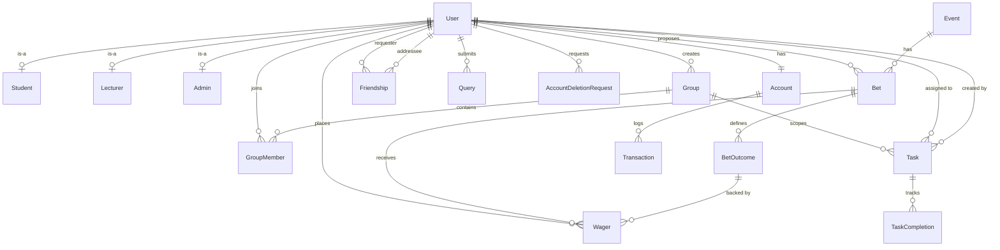

# MadiBets — Project Documentation

> **Team**: The Bloodline | **Module**: WRRV301  
> **Last Updated**: 18 August 2026  

---

## 1. Project Overview

**MadiBets** is a university-internal prediction-market platform for Nelson Mandela University. Students and lecturers wager virtual currency ("MadiBucks") on campus events — academic, sport, and social. The system is a full-stack Java web application built on Spring Boot with a MySQL database and a vanilla HTML/CSS/JS frontend.

### Tech Stack

| Layer | Technology | Version |
|---|---|---|
| Language | Java | 17 |
| Framework | Spring Boot (starter-web) | 3.3.0 |
| Build | Maven | — |
| Database | MySQL | 8.0 |
| JDBC Driver | MySQL Connector/J | (managed by Spring) |
| Password Hashing | jBCrypt | 0.4 |
| Frontend | Vanilla HTML + CSS + JavaScript | — |
| Fonts | Google Fonts (Outfit, Plus Jakarta Sans) | — |
| Server Port | `8081` | — |

---

## 2. Project Structure

```
MadiBets/
├── .gitignore
├── pom.xml                               # Maven build config (Spring Boot parent)
├── README.md                             # Team onboarding guide
├── db/
│   ├── db.properties.example             # Template — credentials placeholder
│   ├── madibets_schema.sql               # Full schema: 16 tables, design notes
│   ├── migrate_multi_outcome.sql         # Migration: add BetOutcome table
│   ├── migrate_multi_wager.sql           # Migration: split Bet into market + Wager
│   └── seed_admin.sql                    # Inserts the default Admin account
├── docs/
│   ├── PROJECT_DOCUMENTATION.md          # This file
│   └── controllers_readme.txt            # Controller layer notes
├── src/main/java/com/bloodline/madibets/
│   ├── Main.java                         # Spring Boot entry point
│   ├── config/
│   │   └── DatabaseConnection.java       # JDBC helper (reads db.properties)
│   ├── model/
│   │   ├── User.java                     # ✅ userID, name, surname, email, password, userType, studentNo, staffNo, avatarPath, createdDate
│   │   ├── Account.java                  # ✅ accountID, balance, userID
│   │   ├── AccountDeletionRequest.java   # ✅ requestID, userID, requestDate, status, userName, userEmail
│   │   ├── Bet.java                      # ✅ Market POJO — betID, userID, eventID, description, outcome, status, deadline, winningOutcomeID, proposedDate, gradedDate, gradedBy + transient outcomes/wagerCount/totalStaked
│   │   ├── BetOutcome.java               # ✅ outcomeID, betID, label, odds, position
│   │   ├── DashboardStats.java           # ✅ Admin dashboard aggregates
│   │   ├── Event.java                    # ✅ eventID, eventDescription, date, startTime, endTime, status
│   │   ├── Friendship.java              # ✅ friendshipID, requesterID, addresseID, status + transient requesterName, addresseName
│   │   ├── Group.java                   # ✅ groupID, groupName, description, createdBy, createdDate
│   │   ├── LecturerStats.java           # ✅ Lecturer dashboard aggregates
│   │   ├── Query.java                   # ✅ queryID, title, description, queryDate, userID, resolvedStatus
│   │   ├── Task.java                    # ✅ taskID, title, description, groupID, userID, amount, createdBy
│   │   ├── TaskCompletion.java          # ✅ completionID, taskID, userID, completionStatus, completionDate
│   │   └── Wager.java                  # ✅ wagerID, betID, outcomeID, userID, stake, amountToBeWon, placedDate
│   ├── dao/
│   │   ├── UserDAO.java                  # ✅ Full CRUD + balance + avatar + counts + growth
│   │   ├── AccountDAO.java              # ✅ Balance reads, transactional balance adjustments, audit trail
│   │   ├── AdminDAO.java                # ✅ Dashboard stats aggregation (8 metrics)
│   │   ├── BetDAO.java                  # ✅ Full bet lifecycle — propose, activate, grade, delete, wager
│   │   ├── DeletionRequestDAO.java      # ✅ Account deletion request CRUD
│   │   ├── EventDAO.java               # ✅ Event lookup for proposal validation
│   │   ├── FriendshipDAO.java           # ✅ Full friend management — requests, accept, reject, remove, search
│   │   ├── GroupDAO.java                # ✅ Group CRUD, member management, search
│   │   ├── LeaderboardDAO.java          # ✅ Bet history, rankings, user stats, monthly allowance
│   │   ├── LecturerDAO.java             # ✅ Lecturer dashboard stats
│   │   ├── QueryDAO.java               # ✅ Support query CRUD with user join
│   │   └── TaskDAO.java                # ✅ Task creation and queries by group/creator
│   ├── service/
│   │   ├── AuthService.java             # ✅ Register (BCrypt) + Login
│   │   ├── AccountService.java          # ✅ Balance reads (delegates to AccountDAO)
│   │   ├── BetService.java             # ✅ Full bet lifecycle with multi-outcome support, admin guards, transactional settlement
│   │   ├── FriendshipService.java       # ✅ Friend request validation + lifecycle
│   │   └── LeaderboardService.java      # ✅ Bet history, rankings, user stats, monthly allowance
│   └── controller/
│       ├── AdminController.java          # ✅ REST: /api/admin/dashboard-stats
│       ├── AuthController.java          # ✅ REST: /api/auth/register, /api/auth/login
│       ├── BetController.java           # ✅ REST: /api/bets/* (full lifecycle)
│       ├── FriendshipController.java    # ✅ REST: /api/friends/* (full CRUD)
│       ├── GroupController.java         # ✅ REST: /api/groups/* (create, list, join, virtual groups)
│       ├── LeaderboardController.java   # ✅ REST: /api/leaderboard/* (history, rankings, stats, allowance)
│       ├── LecturerController.java      # ✅ REST: /api/lecturers/{id}/dashboard-stats
│       ├── QueryController.java         # ✅ REST: /api/queries/* (submit, list, status update)
│       ├── TaskController.java          # ✅ REST: /api/tasks?createdBy=N
│       └── UserController.java          # ✅ REST: /api/users/* (profile, avatar, password, delete requests)
├── src/main/resources/
│   ├── application.properties           # server.port=8081
│   ├── db.properties                    # Local MySQL creds (git-ignored)
│   └── static/
│       ├── index.html                   # SPA (landing, auth, dashboards, all panels)
│       ├── style.css                    # ~43 KB of custom CSS
│       ├── app.js                       # ~119 KB client-side logic
│       ├── logo.png                     # MadiBets logo
│       ├── banner.png                   # Landing page banner
│       └── images/                      # Additional image assets
├── uploads/                             # Avatar uploads (git-ignored)
└── target/                              # Maven build output (git-ignored)
```

---

## 3. Database Schema

The schema lives in [madibets_schema.sql](file:///c:/Users/siwap/OneDrive/Documents/GitHub/MadiBets/db/madibets_schema.sql) and defines **16 tables** in the `madibets` database:

### Entity-Relationship Summary



### Table Details

| Table | Purpose | Key Columns |
|---|---|---|
| `User` | Core identity | `userID` (PK, auto), `name`, `surname`, `email` (unique), `password` (hash), `userType` (ENUM), `avatarPath`, `createdDate` |
| `Student` | Subtype of User (1:1) | `userID` (PK+FK), `studentNo` (unique) |
| `Lecturer` | Subtype of User (1:1) | `userID` (PK+FK), `staffNo` (unique) |
| `Admin` | Subtype of User (1:1) | `userID` (PK+FK) |
| `Account` | MadiBucks wallet | `accountID` (PK), `userID` (FK, unique), `balance` (default 100.00) |
| `Transaction` | Audit trail for every balance change | `transactionID` (PK), `payoutAmount`, `description`, `date`, `accountID` (FK) |
| `Event` | Betting event | `eventID` (PK), `eventDescription`, `date`, `startTime`, `endTime`, `status` (ENUM) |
| `Bet` | Market definition (not individual stakes) | `betID` (PK), `userID` (FK, proposer), `eventID` (FK, nullable), `description`, `outcome` (ENUM: PENDING/DECIDED/CANCELLED), `status` (ENUM: PROPOSED/ACTIVE/GRADED/DELETED), `deadline`, `winningOutcomeID`, `proposedDate`, `gradedDate`, `gradedBy` |
| `BetOutcome` | 2–4 possible outcomes per bet | `outcomeID` (PK), `betID` (FK), `label`, `odds` (DECIMAL, null while PROPOSED), `position` |
| `Wager` | One student's stake on one outcome | `wagerID` (PK), `betID` (FK), `outcomeID` (FK), `userID` (FK), `stake`, `amountToBeWon`, `placedDate`. UNIQUE (betID, userID) |
| `Friendship` | Social connections | `friendshipID` (PK), `requesterID`/`addresseID` (FKs), `status` (ENUM: PENDING/ACCEPTED/REJECTED) |
| `Group` | Leagues / groups | `groupID` (PK), `groupName`, `description`, `createdBy` (FK), `createdDate` |
| `GroupMember` | Group membership | `groupMemberID` (PK), `groupID`/`userID` (FKs), `role` (ENUM: OWNER/MEMBER). UNIQUE (groupID, userID) |
| `Task` | Lecturer-set tasks (group-scoped) | `taskID` (PK), `title`, `description`, `groupID` (FK), `userID` (FK, nullable assignee), `amount` (MadiBucks reward), `createdBy` (FK) |
| `TaskCompletion` | Task completion tracking | `completionID` (PK), `taskID`/`userID` (FKs), `completionStatus` (ENUM: PENDING/COMPLETED/REJECTED), `completionDate` |
| `Query` | Support tickets | `queryID` (PK), `title`, `description`, `queryDate`, `userID` (FK), `resolvedStatus` (ENUM: OPEN/RESOLVED) |
| `AccountDeletionRequest` | Soft-delete workflow | `requestID` (PK), `userID` (FK), `requestDate`, `status` (ENUM: NEW/DONE/REJOIN) |

### Seed Data

[seed_admin.sql](file:///c:/Users/siwap/OneDrive/Documents/GitHub/MadiBets/db/seed_admin.sql) creates the initial admin account:
- **Email**: `admin@mandela.ac.za`
- **Password**: `12345` (stored as BCrypt hash)
- **Balance**: 0.00 MB

### Migration Scripts

| File | Purpose |
|---|---|
| [migrate_multi_wager.sql](file:///c:/Users/siwap/OneDrive/Documents/GitHub/MadiBets/db/migrate_multi_wager.sql) | Splits the Bet table into market + Wager so multiple students can bet on one market |
| [migrate_multi_outcome.sql](file:///c:/Users/siwap/OneDrive/Documents/GitHub/MadiBets/db/migrate_multi_outcome.sql) | Adds the BetOutcome table for multi-outcome markets |

---

## 4. Backend — Implementation Status

> [!NOTE]
> All four use-case series (A–D) are now **fully implemented**. There are no remaining stubs.

### 4.1 Config Layer

#### [DatabaseConnection.java](file:///c:/Users/siwap/OneDrive/Documents/GitHub/MadiBets/src/main/java/com/bloodline/madibets/config/DatabaseConnection.java)
- Reads `db.properties` from the classpath at class-load time
- Provides `getConnection()` — a static factory returning a raw JDBC `Connection`
- Fails fast with a clear message if `db.properties` is missing

---

### 4.2 Model Layer (14 POJOs)

| Model | Fields | Status |
|---|---|---|
| [User.java](file:///c:/Users/siwap/OneDrive/Documents/GitHub/MadiBets/src/main/java/com/bloodline/madibets/model/User.java) | `userID`, `name`, `surname`, `email`, `password`, `userType`, `studentNo`, `staffNo`, `avatarPath`, `createdDate` | ✅ |
| [Account.java](file:///c:/Users/siwap/OneDrive/Documents/GitHub/MadiBets/src/main/java/com/bloodline/madibets/model/Account.java) | `accountID`, `balance`, `userID` | ✅ |
| [Bet.java](file:///c:/Users/siwap/OneDrive/Documents/GitHub/MadiBets/src/main/java/com/bloodline/madibets/model/Bet.java) | `betID`, `userID`, `eventID`, `description`, `outcome`, `status`, `deadline`, `winningOutcomeID`, `proposedDate`, `gradedDate`, `gradedBy` + transient `outcomes`, `wagerCount`, `totalStaked` | ✅ |
| [BetOutcome.java](file:///c:/Users/siwap/OneDrive/Documents/GitHub/MadiBets/src/main/java/com/bloodline/madibets/model/BetOutcome.java) | `outcomeID`, `betID`, `label`, `odds`, `position` | ✅ |
| [Wager.java](file:///c:/Users/siwap/OneDrive/Documents/GitHub/MadiBets/src/main/java/com/bloodline/madibets/model/Wager.java) | `wagerID`, `betID`, `outcomeID`, `userID`, `stake`, `amountToBeWon`, `placedDate` | ✅ |
| [Event.java](file:///c:/Users/siwap/OneDrive/Documents/GitHub/MadiBets/src/main/java/com/bloodline/madibets/model/Event.java) | `eventID`, `eventDescription`, `date`, `startTime`, `endTime`, `status` | ✅ |
| [Friendship.java](file:///c:/Users/siwap/OneDrive/Documents/GitHub/MadiBets/src/main/java/com/bloodline/madibets/model/Friendship.java) | `friendshipID`, `requesterID`, `addresseID`, `status` + transient `requesterName`, `addresseName` | ✅ |
| [Group.java](file:///c:/Users/siwap/OneDrive/Documents/GitHub/MadiBets/src/main/java/com/bloodline/madibets/model/Group.java) | `groupID`, `groupName`, `description`, `createdBy`, `createdDate` | ✅ |
| [Query.java](file:///c:/Users/siwap/OneDrive/Documents/GitHub/MadiBets/src/main/java/com/bloodline/madibets/model/Query.java) | `queryID`, `title`, `description`, `queryDate`, `userID`, `resolvedStatus` | ✅ |
| [Task.java](file:///c:/Users/siwap/OneDrive/Documents/GitHub/MadiBets/src/main/java/com/bloodline/madibets/model/Task.java) | `taskID`, `title`, `description`, `groupID`, `userID`, `amount`, `createdBy` | ✅ |
| [TaskCompletion.java](file:///c:/Users/siwap/OneDrive/Documents/GitHub/MadiBets/src/main/java/com/bloodline/madibets/model/TaskCompletion.java) | `completionID`, `taskID`, `userID`, `completionStatus`, `completionDate` | ✅ |
| [DashboardStats.java](file:///c:/Users/siwap/OneDrive/Documents/GitHub/MadiBets/src/main/java/com/bloodline/madibets/model/DashboardStats.java) | Admin dashboard aggregates (8 metrics) | ✅ |
| [LecturerStats.java](file:///c:/Users/siwap/OneDrive/Documents/GitHub/MadiBets/src/main/java/com/bloodline/madibets/model/LecturerStats.java) | Lecturer dashboard aggregates | ✅ |
| [AccountDeletionRequest.java](file:///c:/Users/siwap/OneDrive/Documents/GitHub/MadiBets/src/main/java/com/bloodline/madibets/model/AccountDeletionRequest.java) | `requestID`, `userID`, `requestDate`, `status`, `userName`, `userEmail` | ✅ |

---

### 4.3 DAO Layer (12 DAOs)

#### [UserDAO.java](file:///c:/Users/siwap/OneDrive/Documents/GitHub/MadiBets/src/main/java/com/bloodline/madibets/dao/UserDAO.java) — Owner: Siwapiwe

| Method | Use Case | Description |
|---|---|---|
| `register(User)` | A100 | Transactional insert into `User` + subtype table + `Account` (100 MB). Returns generated `userID`. |
| `findByEmail(String)` | A200 | Joins `User`, `Student`, `Lecturer` to return a full `User` by email. |
| `findById(int)` | A300 | Same join, lookup by `userID`. |
| `getAllUsers()` | Admin | Returns all users with subtype joins. |
| `updateProfile(User)` | A400 | Updates `name`, `surname`, `email` on `User`. |
| `updateAvatar(int, String)` | A500 | Updates the `avatarPath` column for a user. |
| `getAvatarPath(int)` | — | Reads the current avatar path for a user. |
| `delete(int)` | A600 | Transactional delete: re-assigns groups/tasks/bets to admin, deletes transactions, then cascades. |
| `getAccountBalance(int)` | — | Reads `balance` from `Account` for a given `userID`. |
| `countAllUsers()` | Admin | Counts non-admin users. |
| `countStudents()` | Admin | Counts STUDENT users. |
| `getWeeklyGrowth(boolean)` | Admin | Calculates weekly registration growth percentage. |

#### [BetDAO.java](file:///c:/Users/siwap/OneDrive/Documents/GitHub/MadiBets/src/main/java/com/bloodline/madibets/dao/BetDAO.java) — Owner: Kieran

| Method | Use Case | Description |
|---|---|---|
| `findActiveBets()` | B700 | All ACTIVE bets with outcomes, wager counts, and total staked. Avoids N+1 with batch outcome load. |
| `findProposedBets()` | B300 | PROPOSED bets in the admin review queue (oldest first). |
| `findById(int)` | — | Single-row read with outcomes attached. |
| `propose(Bet, List<String>)` | B200 | Transactional insert of market + 2-4 outcome labels. |
| `activate(int, LocalDateTime, Map)` | B300 | Prices outcomes and opens the bet, guarded by PROPOSED status. |
| `reject(int)` | B300 | Sets status to DELETED, guarded by PROPOSED status. |
| `placeWager(Connection, ...)` | B100 | INSERT-SELECT wager with inline validation (ACTIVE, priced outcome, deadline not passed). |
| `findWagersByBet(Connection, int)` | B400/B600 | All wagers on a bet for settlement. |
| `grade(Connection, ...)` | B400 | Records winning outcome and closes bet, guarded by ACTIVE status. |
| `delete(Connection, int)` | B500 | Soft delete (status DELETED), keeps audit trail. |

#### [AccountDAO.java](file:///c:/Users/siwap/OneDrive/Documents/GitHub/MadiBets/src/main/java/com/bloodline/madibets/dao/AccountDAO.java) — Owner: Kieran

| Method | Use Case | Description |
|---|---|---|
| `findByUserId(int)` | B100/C400/C500 | Reads the full Account row. |
| `readBalance(int)` | C400/C500 | Balance-only read. |
| `adjustBalance(int, BigDecimal, String)` | B600 | Standalone transactional balance adjust + Transaction log. |
| `adjustBalance(Connection, int, BigDecimal)` | B100/B600 | In-transaction balance adjust with overdraft guard (`balance + delta >= 0`). |
| `logTransaction(Connection, int, BigDecimal, String)` | B100/B600 | Audit row inserted in the same transaction as balance changes. |

#### [FriendshipDAO.java](file:///c:/Users/siwap/OneDrive/Documents/GitHub/MadiBets/src/main/java/com/bloodline/madibets/dao/FriendshipDAO.java) — Owner: Jason

| Method | Use Case | Description |
|---|---|---|
| `findFriends(int)` | C100 | All ACCEPTED friendships for a user (both directions), with names via User join. |
| `findPendingRequests(int)` | C100 | Pending friend requests sent TO this user. |
| `sendRequest(int, int)` | C200 | Creates a PENDING friendship, returns generated ID. |
| `acceptRequest(int)` | C200 | Changes PENDING → ACCEPTED. |
| `rejectRequest(int)` | C200 | Changes PENDING → REJECTED. |
| `remove(int)` | C300 | Hard-deletes a friendship. |
| `findBetweenUsers(int, int)` | — | Duplicate check: any existing friendship (either direction). |

#### [LeaderboardDAO.java](file:///c:/Users/siwap/OneDrive/Documents/GitHub/MadiBets/src/main/java/com/bloodline/madibets/dao/LeaderboardDAO.java) — Owner: Jason

| Method | Use Case | Description |
|---|---|---|
| `findBetsByUser(int)` | C400 | Bet history via Wager→Bet→BetOutcome joins, newest first. Derives outcome as YES/NO from `winningOutcomeID`. |
| `getRankings(int, String)` | C500 | Top N students ranked by balance, wins, or totalBets. |
| `getUserRank(int)` | C500 | Position of one user in balance ranking. |
| `getTotalPlayers()` | C500 | Total student count for "rank N of M". |
| `getWeeklyBalanceGrowth(int)` | C500 | Weekly balance growth % from Transaction data. |
| `getUserBetStats(int)` | C500 | Win/loss/pending counts for one user. |
| `grantMonthlyAllowance()` | C600 | Grants 100 MB to all accounts. |

#### [GroupDAO.java](file:///c:/Users/siwap/OneDrive/Documents/GitHub/MadiBets/src/main/java/com/bloodline/madibets/dao/GroupDAO.java) — Owner: Pieter

| Method | Use Case | Description |
|---|---|---|
| `create(Group)` | D100 | Transactional insert of Group + owner GroupMember row. |
| `findById(int)` | D200 | Single group by ID. |
| `searchByNameOrId(String)` | D200 | Name LIKE search or numeric ID lookup. |
| `findByUser(int)` | D200 | Groups a user belongs to (via GroupMember join). |
| `findByCreator(int)` | D200 | Groups created by a specific user. |
| `addMember(int, int)` | D300 | Inserts a MEMBER row; returns false on duplicate (UNIQUE constraint). |
| `isMember(int, int)` | — | Membership check. |

#### [TaskDAO.java](file:///c:/Users/siwap/OneDrive/Documents/GitHub/MadiBets/src/main/java/com/bloodline/madibets/dao/TaskDAO.java) — Owner: Pieter

| Method | Use Case | Description |
|---|---|---|
| `create(Task)` | D400 | Inserts a task with title, description, groupID, optional assignee, reward amount, and creator. |
| `findByGroup(int)` | D500 | All tasks for a given group. |
| `findByCreator(int)` | D501 | All tasks created by a specific lecturer. |

#### [QueryDAO.java](file:///c:/Users/siwap/OneDrive/Documents/GitHub/MadiBets/src/main/java/com/bloodline/madibets/dao/QueryDAO.java) — Owner: Pieter

| Method | Use Case | Description |
|---|---|---|
| `create(Query)` | D600 | Inserts a support query with title, description, userID, OPEN status. |
| `findAllWithUser()` | D700 | All queries with user email, newest first. |
| `updateStatus(int, String)` | D700 | Updates resolvedStatus (OPEN → RESOLVED). |

#### [AdminDAO.java](file:///c:/Users/siwap/OneDrive/Documents/GitHub/MadiBets/src/main/java/com/bloodline/madibets/dao/AdminDAO.java)

| Method | Description |
|---|---|
| `getDashboardStats()` | Aggregates 8 metrics: bets proposed today, bets placed today, bets pending review, upcoming events, total users, users joined today, open support queries, users rewarded today. |

#### [LecturerDAO.java](file:///c:/Users/siwap/OneDrive/Documents/GitHub/MadiBets/src/main/java/com/bloodline/madibets/dao/LecturerDAO.java)

| Method | Description |
|---|---|
| `getDashboardStats(int)` | Lecturer-specific aggregates: total groups (created by this lecturer), total students, new students this week, active today. |

#### [EventDAO.java](file:///c:/Users/siwap/OneDrive/Documents/GitHub/MadiBets/src/main/java/com/bloodline/madibets/dao/EventDAO.java) — Owner: Kieran

| Method | Description |
|---|---|
| `findById(int)` | Event lookup used by B200 to validate proposal links. |

#### [DeletionRequestDAO.java](file:///c:/Users/siwap/OneDrive/Documents/GitHub/MadiBets/src/main/java/com/bloodline/madibets/dao/DeletionRequestDAO.java)

| Method | Description |
|---|---|
| `create(int)` | Creates a NEW deletion request for a user. |
| `getAll()` | Lists all deletion requests with user info, newest first. |
| `updateStatus(int, String)` | Updates request status (e.g. NEW → DONE or REJOIN). |
| `hasPendingDeleteRequest(int)` | Checks if a user has an active NEW request (blocks login). |

---

### 4.4 Service Layer (5 Services)

#### [AuthService.java](file:///c:/Users/siwap/OneDrive/Documents/GitHub/MadiBets/src/main/java/com/bloodline/madibets/service/AuthService.java) — Owner: Siwapiwe

| Method | Use Case | Description |
|---|---|---|
| `register(User, String)` | A100 | Hashes password with BCrypt, delegates to `UserDAO.register()`. |
| `login(String, String)` | A200 | Looks up user by email, verifies BCrypt hash. Returns `User` on success, `null` on failure. |

#### [AccountService.java](file:///c:/Users/siwap/OneDrive/Documents/GitHub/MadiBets/src/main/java/com/bloodline/madibets/service/AccountService.java) — Owner: Kieran

| Method | Description |
|---|---|
| `getBalance(int)` | Reads current balance via AccountDAO. Returns null if no account exists. |

#### [BetService.java](file:///c:/Users/siwap/OneDrive/Documents/GitHub/MadiBets/src/main/java/com/bloodline/madibets/service/BetService.java) — Owner: Kieran

| Method | Use Case | Description |
|---|---|---|
| `viewActiveBets()` | B700 | Lists all ACTIVE bets with outcomes and wager aggregates. |
| `viewProposedBets()` | B300 | Admin review queue. |
| `proposeBet(int, Integer, String, List)` | B200 | Validates description (non-blank), outcome labels (2-4, unique, ≤100 chars), optional event link (exists, not ended). Creates PROPOSED bet. |
| `approveProposal(int, Map, LocalDateTime, int)` | B300 | Admin-only. Validates odds (>1.00, ≤9999.99), deadline (future), prices all outcomes, activates bet. |
| `rejectProposal(int, int)` | B300 | Admin-only. Sets status to DELETED. |
| `placeBet(int, int, int, BigDecimal)` | B100 | Validates stake (positive, ≤2 decimals), checks bet ACTIVE + deadline + outcome exists. Debit + wager + audit in one DB transaction. UNIQUE constraint blocks double wagers. |
| `gradeBet(int, Integer, boolean, int)` | B400+B600 | Admin-only. Records winner or cancellation. Pays winning wagers or refunds all if cancelled. All in one DB transaction. |
| `deleteBet(int, int)` | B500 | Admin-only. Soft-deletes PROPOSED/ACTIVE bets. Refunds all wagers on ACTIVE bets. |

#### [FriendshipService.java](file:///c:/Users/siwap/OneDrive/Documents/GitHub/MadiBets/src/main/java/com/bloodline/madibets/service/FriendshipService.java) — Owner: Jason

| Method | Use Case | Description |
|---|---|---|
| `getFriends(int)` | C100 | Returns accepted friends. |
| `getPendingRequests(int)` | C100 | Returns incoming pending requests. |
| `sendFriendRequest(int, int)` | C200 | Validates: no self-request, no duplicate (ACCEPTED or PENDING). Allows re-send after REJECTED (deletes old record). |
| `acceptRequest(int)` | C200 | Delegates to DAO. |
| `rejectRequest(int)` | C200 | Delegates to DAO. |
| `removeFriend(int)` | C300 | Delegates to DAO. |

#### [LeaderboardService.java](file:///c:/Users/siwap/OneDrive/Documents/GitHub/MadiBets/src/main/java/com/bloodline/madibets/service/LeaderboardService.java) — Owner: Jason

| Method | Use Case | Description |
|---|---|---|
| `getBetHistory(int)` | C400 | Returns user's bet history. |
| `getRankings(int, String)` | C500 | Top N rankings by balance/wins/totalBets. Defaults: limit=50, sortBy=balance. |
| `getUserStats(int)` | C500 | Combines bet stats + rank + total players + weekly growth. |
| `grantMonthlyAllowance()` | C600 | Grants 100 MB to all accounts, returns count updated. |

---

### 4.5 Controller Layer (10 Controllers)

#### [AuthController.java](file:///c:/Users/siwap/OneDrive/Documents/GitHub/MadiBets/src/main/java/com/bloodline/madibets/controller/AuthController.java) — Owner: Siwapiwe

| Endpoint | Method | Validations |
|---|---|---|
| `POST /api/auth/register` | Register | All required fields, `@mandela.ac.za` email only, 9-digit student no., staff no. for lecturers, duplicate detection. Blocks login if pending deletion request. |
| `POST /api/auth/login` | Login | Email + password required. Checks for pending deletion request (returns 403). Returns user object + balance on success, 401 on bad credentials. |

#### [UserController.java](file:///c:/Users/siwap/OneDrive/Documents/GitHub/MadiBets/src/main/java/com/bloodline/madibets/controller/UserController.java) — Owner: Siwapiwe

| Endpoint | Method | Description |
|---|---|---|
| `GET /api/users/all` | List All Users | Returns all users (passwords stripped). |
| `GET /api/users/lookup?email=` | Lookup by Email | Returns user by email, 404 if not found. |
| `GET /api/users/count` | User Counts | Returns totalUsers, totalStudents, and weekly growth percentages. |
| `GET /api/users/{id}` | View Profile | Returns user + account balance (password stripped). |
| `PUT /api/users/{id}` | Update Profile | Updates name, surname, email. |
| `DELETE /api/users/{id}` | Delete Account | Permanently removes user with cascade. |
| `POST /api/users/{id}/avatar` | Upload Avatar | Multipart file upload, saves to `uploads/avatars/`, deletes old avatar, stores path in DB. |
| `PUT /api/users/{id}/password` | Change Password | BCrypt hashes new password, updates directly. |
| `POST /api/users/{id}/delete-request` | Submit Delete Request | Creates a soft-delete request (NEW status). |
| `GET /api/users/delete-requests` | List Delete Requests | All deletion requests with user info. |
| `PUT /api/users/delete-requests/{reqId}/reinstate` | Reinstate Account | Sets request status to REJOIN. |

#### [BetController.java](file:///c:/Users/siwap/OneDrive/Documents/GitHub/MadiBets/src/main/java/com/bloodline/madibets/controller/BetController.java) — Owner: Kieran

| Endpoint | Method | Description |
|---|---|---|
| `GET /api/bets/active` | B700 | All ACTIVE bets with outcomes, deadlines, wager aggregates, and `open` flag. |
| `GET /api/bets/proposed` | B300 | Admin review queue (PROPOSED bets with unpriced outcomes). |
| `POST /api/bets/propose` | B200 | `{userID, eventID?, description, outcomes:[label]}` → `201 {betID}` |
| `POST /api/bets/{id}/approve` | B300 | `{odds:{outcomeID:odds}, deadline, adminUserID}` → activates bet. |
| `POST /api/bets/{id}/reject` | B300 | `{adminUserID}` → soft-deletes proposal. |
| `POST /api/bets/{id}/wager` | B100 | `{userID, outcomeID, stake}` → `{betID, newBalance}`. Debit + wager atomic. |
| `POST /api/bets/{id}/grade` | B400+B600 | `{winningOutcomeID OR cancelled:true, adminUserID}` → settles all wagers. |
| `DELETE /api/bets/{id}?adminUserID=N` | B500 | Soft-deletes, refunds active wagers. |

#### [FriendshipController.java](file:///c:/Users/siwap/OneDrive/Documents/GitHub/MadiBets/src/main/java/com/bloodline/madibets/controller/FriendshipController.java) — Owner: Jason

| Endpoint | Method | Description |
|---|---|---|
| `GET /api/friends/{userID}` | C100 | All accepted friends for a user. |
| `GET /api/friends/{userID}/pending` | C100 | Pending friend requests sent TO this user. |
| `POST /api/friends/request` | C200 | `{requesterID, addresseID}` → sends friend request. |
| `PUT /api/friends/{friendshipID}/accept` | C200 | Accepts a pending request. |
| `PUT /api/friends/{friendshipID}/reject` | C200 | Rejects a pending request. |
| `DELETE /api/friends/{friendshipID}` | C300 | Removes an existing friendship. |

#### [LeaderboardController.java](file:///c:/Users/siwap/OneDrive/Documents/GitHub/MadiBets/src/main/java/com/bloodline/madibets/controller/LeaderboardController.java) — Owner: Jason

| Endpoint | Method | Description |
|---|---|---|
| `GET /api/leaderboard/history/{userID}` | C400 | User's bet history (newest first). |
| `GET /api/leaderboard/rankings?limit=50&sortBy=balance` | C500 | Top N students ranked by balance, wins, or totalBets. |
| `GET /api/leaderboard/stats/{userID}` | C500 | User's rank position, bet stats, and weekly growth. |
| `POST /api/leaderboard/allowance` | C600 | Grants 100 MB monthly allowance to all accounts. |

#### [GroupController.java](file:///c:/Users/siwap/OneDrive/Documents/GitHub/MadiBets/src/main/java/com/bloodline/madibets/controller/GroupController.java) — Owner: Pieter

| Endpoint | Method | Description |
|---|---|---|
| `POST /api/groups` | D100 | Creates a group, adds creator as OWNER. Requires `groupName`. |
| `GET /api/groups?q=&userId=&createdBy=` | D200 | Lists groups. With `userId`: prepends virtual "Overall" and "My Friends" groups. With `createdBy`: groups by that creator. With `q`: search by name/ID. |
| `GET /api/groups/{id}?userId=` | D200 | Group detail. ID 0 = virtual "Overall" (non-admin user count). ID -1 = virtual "My Friends" (accepted friend count). |
| `POST /api/groups/{id}/join` | D300 | `{userID}` → joins a group. Returns 409 if already member. |

#### [TaskController.java](file:///c:/Users/siwap/OneDrive/Documents/GitHub/MadiBets/src/main/java/com/bloodline/madibets/controller/TaskController.java) — Owner: Pieter

| Endpoint | Method | Description |
|---|---|---|
| `GET /api/tasks?createdBy=N` | D500 | Lists tasks created by a specific lecturer. |

#### [QueryController.java](file:///c:/Users/siwap/OneDrive/Documents/GitHub/MadiBets/src/main/java/com/bloodline/madibets/controller/QueryController.java) — Owner: Pieter

| Endpoint | Method | Description |
|---|---|---|
| `GET /api/queries` | D700 | All support queries with user email, newest first. |
| `POST /api/queries` | D600 | `{title, description, userID}` → creates a support query. |
| `PUT /api/queries/{id}/status` | D700 | `{status}` → updates resolvedStatus. |

#### [AdminController.java](file:///c:/Users/siwap/OneDrive/Documents/GitHub/MadiBets/src/main/java/com/bloodline/madibets/controller/AdminController.java)

| Endpoint | Method | Description |
|---|---|---|
| `GET /api/admin/dashboard-stats` | Admin Dashboard | Aggregated stats: bets today, pending review, upcoming events, user counts, open queries, rewarded users. |

#### [LecturerController.java](file:///c:/Users/siwap/OneDrive/Documents/GitHub/MadiBets/src/main/java/com/bloodline/madibets/controller/LecturerController.java)

| Endpoint | Method | Description |
|---|---|---|
| `GET /api/lecturers/{id}/dashboard-stats` | Lecturer Dashboard | Total groups, total students, new students this week, active today. |

---

## 5. Frontend — Implementation Status

The frontend is a **single-page application** (SPA) served as static files from Spring Boot at `http://localhost:8081`. The codebase has grown to ~119 KB of JavaScript and ~43 KB of CSS.

### 5.1 Views & Panels

| View / Panel | Status | Description |
|---|---|---|
| **Landing Page** (`landing-view`) | ✅ Working | Splash screen with logo, banner, Register/Login buttons |
| **Auth View** (`auth-view`) | ✅ Working | Login & Registration forms with Student/Lecturer role toggle |
| **Student Dashboard** (`panel-dashboard`) | ✅ Working | Live stats (rank, balance, bets, weekly growth), wallet card, profile viewer/editor |
| **Lecturer Dashboard** (`panel-dashboard-lecturer`) | ✅ Working | Lecturer-specific layout with groups navigation, live stats |
| **Admin Dashboard** (`panel-dashboard-admin`) | ✅ Working | Live admin metrics (8 aggregated stats) |
| **Bets Panel** | ✅ Working | Browse active bets, place wagers, propose bets with 2-4 outcomes |
| **Leaderboard Panel** | ✅ Working | Rankings table (sortable by balance/wins/totalBets), bet history |
| **Friends Panel** | ✅ Working | Friend list, send/accept/reject requests, search by email |
| **Groups Panel** (`panel-groups`) | ✅ Working | Virtual groups (Overall, My Friends) + custom groups. Create, search, join. |
| **Help / Query Panel** (`panel-help`) | ✅ Working | Submit support queries (title + description → saved to DB) |
| **Profile Panel** | ✅ Working | View/edit profile, upload avatar, change password |
| **Admin: User Management** (`panel-user-management`) | ✅ Working | List all users, user counts with growth stats |
| **Admin: Accounting** (`panel-accounting`) | ✅ Working | Review/approve/reject bet proposals, grade bets, manage active bets |
| **Admin: Delete Requests** (`panel-delete-request`) | ✅ Working | View deletion requests, reinstate accounts |
| **Admin: Query** (`panel-query`) | ✅ Working | View and resolve support queries |
| **Admin: MadiBucks** (`panel-madibucks`) | ✅ UI shell | Admin panel layout exists |
| **Admin: Reports** (`panel-reports`) | ✅ UI shell | Admin panel layout exists |
| **Admin: Settings** (`panel-settings`) | ✅ UI shell | Admin panel layout exists |

### 5.2 Working Frontend Features

| Feature | Details |
|---|---|
| **Registration** | Form validates `@mandela.ac.za` email, 9-digit student no., role toggle (Student/Lecturer). Calls `POST /api/auth/register`. |
| **Login** | Email + password form. Calls `POST /api/auth/login`. Blocks users with pending deletion requests (403). Stores user in `sessionStorage`. |
| **Session Persistence** | On page load, checks `sessionStorage` for a saved user and auto-loads the dashboard. |
| **Profile Display** | Shows name, email, userType, studentNo/staffNo, avatar. Reads from `GET /api/users/{id}`. |
| **Profile Editing** | Inline edit form (name, surname, email). Calls `PUT /api/users/{id}`. |
| **Avatar Upload** | File picker, preview, upload to `POST /api/users/{id}/avatar`. |
| **Password Change** | Separate form, calls `PUT /api/users/{id}/password`. |
| **Account Deletion** | Soft-delete: creates a request via `POST /api/users/{id}/delete-request`. Admin can reinstate. |
| **Logout** | Clears `sessionStorage`, returns to auth view. |
| **Role-Based Navigation** | Three separate sidebar navs shown by `userType`: Student, Lecturer, Admin. |
| **Collapsible Sidebar** | Toggle button collapses/expands the navigation sidebar with icon swap. |
| **Password Visibility Toggle** | Eye icon toggles password input between text/password. |
| **Toast Notifications** | Success/error toasts with auto-dismiss (4 seconds). |
| **Wallet Display** | Shows MadiBucks balance in header and wallet card with live data. |
| **Bet Proposal** | Students can propose bets with 2-4 named outcomes. |
| **Bet Wagering** | Students pick one outcome and stake MadiBucks. Balance deducted immediately. |
| **Bet Approval/Rejection** | Admin prices outcomes (sets odds), sets wagering deadline, approves or rejects proposals. |
| **Bet Grading** | Admin selects winning outcome or cancels. Payouts/refunds processed automatically. |
| **Friend Requests** | Search by email, send requests, accept/reject incoming requests. |
| **Friend List** | View accepted friends, remove friends. |
| **Leaderboard** | Top 50 students by balance, wins, or total bets. User's own rank and stats. |
| **Bet History** | User's past wagers with outcomes (YES/NO/PENDING/CANCELLED). |
| **Groups** | Create groups, search/join groups, virtual "Overall" and "My Friends" groups. |
| **Support Queries** | Submit queries, admin reviews and resolves them. |
| **Admin Dashboard** | Live metrics from 8 database queries. |
| **Lecturer Dashboard** | Groups created, student counts, activity stats. |

### 5.3 Design & Styling

- **Fonts**: Outfit (headings), Plus Jakarta Sans (body) via Google Fonts
- **Color Scheme**: Navy (`#1B2F5E`), gold (`#F5A623`), light gray background (`#F4F6FA`)
- **Assets**: Custom logo (`logo.png`) and banner image (`banner.png`)
- **CSS**: ~43 KB of custom CSS with sidebar, cards, glassmorphism auth forms, responsive layout
- **JavaScript**: ~119 KB of client-side logic managing all panel routing and API calls

---

## 6. API Reference

Base URL: `http://localhost:8081/api`

### Authentication

| Endpoint | Method | Request Body | Success Response | Error Response |
|---|---|---|---|---|
| `/auth/register` | POST | `{ name, surname, email, password, userType, studentNo?, staffNo? }` | `200 { userID, message }` | `400 { error }` |
| `/auth/login` | POST | `{ email, password }` | `200 { user, balance }` | `401 { error }` / `403` (pending deletion) |

### Users

| Endpoint | Method | Request Body | Success Response | Error Response |
|---|---|---|---|---|
| `/users/all` | GET | — | `200 [User]` | `500 { error }` |
| `/users/lookup?email=` | GET | — | `200 User` | `404 { error }` |
| `/users/count` | GET | — | `200 { totalUsers, totalStudents, userWeeklyGrowth, studentWeeklyGrowth }` | `500 { error }` |
| `/users/{id}` | GET | — | `200 { user, balance }` | `404` / `500 { error }` |
| `/users/{id}` | PUT | `{ name, surname, email }` | `200 { success: true }` | `400 { error }` |
| `/users/{id}` | DELETE | — | `200 { success: true }` | `400 { error }` |
| `/users/{id}/avatar` | POST | Multipart: `avatar` file | `200 { success, avatarUrl }` | `400 { error }` |
| `/users/{id}/password` | PUT | `{ password }` | `200 { success: true }` | `400 { error }` |
| `/users/{id}/delete-request` | POST | — | `200 { success, requestID }` | `400 { error }` |
| `/users/delete-requests` | GET | — | `200 [AccountDeletionRequest]` | `500 { error }` |
| `/users/delete-requests/{reqId}/reinstate` | PUT | — | `200 { success: true }` | `400 { error }` |

### Bets

| Endpoint | Method | Request Body | Success Response | Error Response |
|---|---|---|---|---|
| `/bets/active` | GET | — | `200 { bets: [...] }` | `500 { error }` |
| `/bets/proposed` | GET | — | `200 { bets: [...] }` | `500 { error }` |
| `/bets/propose` | POST | `{ userID, eventID?, description, outcomes:[label] }` | `201 { betID }` | `400 { error }` |
| `/bets/{id}/approve` | POST | `{ odds:{outcomeID:odds}, deadline, adminUserID }` | `200 { betID, status }` | `400 { error }` |
| `/bets/{id}/reject` | POST | `{ adminUserID }` | `200 { betID, status }` | `400 { error }` |
| `/bets/{id}/wager` | POST | `{ userID, outcomeID, stake }` | `200 { betID, newBalance }` | `400 { error }` |
| `/bets/{id}/grade` | POST | `{ winningOutcomeID OR cancelled:true, adminUserID }` | `200 { betID, status, outcome }` | `400 { error }` |
| `/bets/{id}?adminUserID=N` | DELETE | — | `200 { betID, status }` | `400 { error }` |

### Friends

| Endpoint | Method | Request Body | Success Response | Error Response |
|---|---|---|---|---|
| `/friends/{userID}` | GET | — | `200 [Friendship]` | `500 { error }` |
| `/friends/{userID}/pending` | GET | — | `200 [Friendship]` | `500 { error }` |
| `/friends/request` | POST | `{ requesterID, addresseID }` | `200 { friendshipID, message }` | `400 { error }` |
| `/friends/{friendshipID}/accept` | PUT | — | `200 { success, message }` | `400 { error }` |
| `/friends/{friendshipID}/reject` | PUT | — | `200 { success, message }` | `400 { error }` |
| `/friends/{friendshipID}` | DELETE | — | `200 { success, message }` | `400 { error }` |

### Leaderboard

| Endpoint | Method | Request Body | Success Response | Error Response |
|---|---|---|---|---|
| `/leaderboard/history/{userID}` | GET | — | `200 [BetHistory]` | `500 { error }` |
| `/leaderboard/rankings?limit=50&sortBy=balance` | GET | — | `200 [RankEntry]` | `500 { error }` |
| `/leaderboard/stats/{userID}` | GET | — | `200 { rank, totalPlayers, weeklyGrowth, wins, losses, ... }` | `500 { error }` |
| `/leaderboard/allowance` | POST | — | `200 { success, message, accountsUpdated }` | `500 { error }` |

### Groups

| Endpoint | Method | Request Body | Success Response | Error Response |
|---|---|---|---|---|
| `/groups` | POST | `{ groupName, description, createdBy }` | `201 { groupID }` | `400 { error }` |
| `/groups?q=&userId=&createdBy=` | GET | — | `200 [Group]` | `500 { error }` |
| `/groups/{id}?userId=` | GET | — | `200 Group` | `404` / `500 { error }` |
| `/groups/{id}/join` | POST | `{ userID }` | `200 { success: true }` | `409 { error }` |

### Tasks

| Endpoint | Method | Request Body | Success Response | Error Response |
|---|---|---|---|---|
| `/tasks?createdBy=N` | GET | — | `200 [Task]` | `400` / `500 { error }` |

### Support Queries

| Endpoint | Method | Request Body | Success Response | Error Response |
|---|---|---|---|---|
| `/queries` | GET | — | `200 [QueryWithUser]` | `500 { error }` |
| `/queries` | POST | `{ title, description, userID }` | `200 { success, queryID }` | `400 { error }` |
| `/queries/{id}/status` | PUT | `{ status }` | `200 { success: true }` | `400` / `404` |

### Admin & Lecturer Dashboards

| Endpoint | Method | Success Response |
|---|---|---|
| `/admin/dashboard-stats` | GET | `200 DashboardStats` |
| `/lecturers/{id}/dashboard-stats` | GET | `200 LecturerStats` |

---

## 7. Security & Compliance

| Concern | Implementation |
|---|---|
| **Password Storage** | BCrypt hashed via jBCrypt — never stored as plaintext (POPI Act compliance) |
| **Email Domain Lock** | Only `@mandela.ac.za` addresses accepted (validated server-side and client-side) |
| **Credential Isolation** | `db.properties` is in `.gitignore` — local-only credentials |
| **Password Hidden in API** | `user.setPassword(null)` called before returning user objects from controllers |
| **CORS** | `@CrossOrigin(origins = "*")` on all controllers (development mode) |
| **SQL Detail Suppression** | BetController logs SQL exceptions to console only — no SQL detail leaves the server |
| **Account Deletion** | Soft-delete workflow: user creates request → admin reviews → reinstate or delete. Pending requests block login. |
| **Overdraft Protection** | `AccountDAO.adjustBalance()` has a `balance + delta >= 0` guard in SQL |
| **Admin Guards** | Bet lifecycle operations (approve, reject, grade, delete) require an ADMIN userType check |

---

## 8. Team Ownership & Use-Case Mapping

| Member | Series | Responsibilities | Status |
|---|---|---|---|
| **Siwapiwe** | A | UserDAO, AuthService, AuthController, UserController, DatabaseConnection, Main, Frontend SPA, DeletionRequestDAO | ✅ Implemented |
| **Kieran** | B | BetDAO, AccountDAO, EventDAO, BetService, AccountService, BetController (Place/Propose/Approve/Reject/Grade/Delete/View Bets, Balance updates + Transaction audit trail) | ✅ Implemented |
| **Jason** | C | FriendshipDAO, LeaderboardDAO, FriendshipService, LeaderboardService, FriendshipController, LeaderboardController (Friends CRUD, Bet History, Rankings, Monthly Allowance) | ✅ Implemented |
| **Pieter** | D | GroupDAO, TaskDAO, QueryDAO, GroupController, TaskController, QueryController (Groups, Tasks, Support Queries) | ✅ Implemented |

---

## 9. Git History (Recent)

| Commit | Description |
|---|---|
| `309f630` | Merge branch 'integrate/use-case-B' into feature/use-case-A |
| `828d82a` | Fix NaN odds from stale cached app.js; type-aware outcome examples |
| `dee2783` | Multi-outcome bets with admin-set wagering deadlines |
| `bb64383` | Add allowPublicKeyRetrieval to the JDBC URL template |
| `6ebb356` | Link real data to lecturer tasks and groups, update dashboard UI |
| `492522d` | Split Bet into market + Wager so many students can bet on one market |
| `0c3f7ad` | Align B-series UI with FSSB mockups |
| `66dbcda` | Restore db/db.properties.example setup template |
| `2f9b73a` | Integrate B-series bet lifecycle into main web stack |
| `d0809fb` | Implement C-series: Friends (C100-C300) and Leaderboard (C400-C600) |
| `62e20da` | B-series on Spring Boot: adopt A-branch web stack, add BetController |
| `2648084` | B-series web: REST handlers for bet lifecycle + Bets/Accounting UI panels |

---

## 10. Remaining Work

> [!NOTE]
> All four use-case series are fully implemented. The items below are polish/enhancement work, not blockers.

### Backend

- [ ] **Task creation endpoint**: `TaskController` only exposes `GET /api/tasks?createdBy=N`. A `POST /api/tasks` endpoint is needed for the lecturer to create tasks from the UI.
- [ ] **Task completion endpoint**: No controller for `TaskCompletion` yet — lecturers cannot mark tasks as completed via the API.
- [ ] **Password change**: `UserController.updatePassword()` embeds raw SQL — should delegate to a `UserDAO.updatePassword()` method.
- [ ] **Event management**: No controller for creating/managing Events — bets can only reference existing events via direct DB inserts.

### Frontend

- [ ] Wire remaining Admin panels (MadiBucks, Reports, Settings) to backend APIs
- [ ] Implement the "What would you like to know?" prompt bar functionality

### Design Decisions (Resolved & Remaining)

| Decision | Status |
|---|---|
| Bet = Market + Wager split | ✅ Resolved (Aug 10) — `Bet` + `Wager` + `BetOutcome` tables |
| Transaction ownership | ✅ Resolved — `accountID` FK links transactions to accounts |
| Task → Group linkage | ✅ Resolved — `groupID` FK on Task table |
| Bet category (Academic/Sport/Social) | ❓ Not yet modelled — decide if in scope for demo |
| Leagues concept | ❓ Not modelled — virtual "Overall" and "My Friends" groups serve a similar purpose |

---

## 11. How to Run

1. **Database**: Run `db/madibets_schema.sql` in MySQL Workbench, then optionally `db/seed_admin.sql`
2. **Credentials**: Copy `db/db.properties.example` → `src/main/resources/db.properties` and set your MySQL password
3. **Start**: Run `Main.java` or `mvn spring-boot:run`
4. **Access**: Open `http://localhost:8081` in a browser
